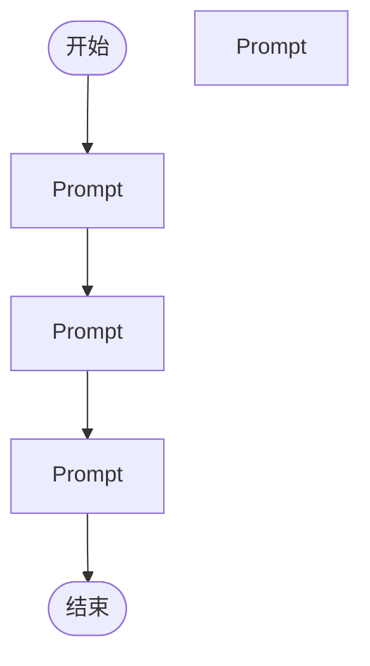

# workflow

## 步骤

### n4 (start)

default agent 驱动 stock-trade 交易游戏工作流

1. 了解玩法: 虚拟账户¥10万+真实行情逐日推进; 每轮决策{买入·卖出·持有·不建仓}, /api/step 成交后按后续行情结算, 盈亏反馈复盘反传 textron
2. 调 GET /api/health 探活
3. 调 POST /api/enter 自动进入(空 body 不指定股票): default 有进行中→continue; 否则载入 active 存档; 全无→随机新开
4. 调 GET /api/prompt?session_id= 取决策提示词: 含当前价/涨跌幅/持仓, 截止最近收盘, 面向下一交易日
5. 调 POST /api/step: body{session_id,decision,tradePrice,tradeQuantity,confidence}, 返回 trade_result 与 portfolio(总资产/浮盈亏/收益率)
6. 调 GET /api/saves 查存档状态(active进行中/ended已结束)
7. 调 POST /api/load {file,force?} 恢复存档; 有进行中异股无 force→409
8. 调 POST /api/resume {file,force?} 复活 ended 档为 active
9. 调 POST /api/finish 结束游戏并持久化
10. 守卫: worker 禁获取后续行情; 禁剧透走势; 通知/enter 禁指定股票日期, 选股交 A/B 裁决或 load/resume
11. 衔接: 杀旧进程与启动 guard/sender/worker 三件套由后继节点执行

### n5 (prompt)

sender根据2次交易，和股票后续走势给worker 打分 盈亏比，持仓效率，盈利能力，回撤幅度，仓位控制，买点卖点，是否错过主升等维度打分，苛刻打分，-5到5分，输出格式：<反馈>：上次交易分数{具体分数} ,打分依据,不要剧透后续行情，发给worker 复盘，worker完事后通知sender

### n6 (prompt)

1. 通知：guard 调 coms_send 向 sender 下发指令「开始交易游戏：完成2次交易推进」，不要指定股票和日期 简单通知就完成任务了。
2. 验证：sender 调 GET http://127.0.0.1:7860/api/health 确认 UI 服务在线；
3. 执行：sender 调 POST http://127.0.0.1:7860/api/enter进入交易游戏4. 取：sender 调 GET http://127.0.0.1:7860/api/prompt?session_id={session_id}，取 data.prompt 决策提示词(含当前价/涨跌幅/持仓组合)
5. 发：sender 调 coms_send 把 data.prompt 发至 worker
6. 执行：worker 依据 prompt 产出决策 JSON {decision∈买入·卖出·持有·不建仓继续观察·不建仓更换股票, tradePrice, tradeQuantity, confidence∈高·中·低, reasoning}；worker 做决策时不能用任何手段获取后续股票数据
7. 发：worker 调 coms_send 把决策 JSON 发回 sender
8. 执行：sender 调 POST http://127.0.0.1:7860/api/step，body {session_id,decision,tradePrice,tradeQuantity,confidence}，取返回 step.trade_result 与 step.portfolio(总资产/浮盈亏/收益率)
9. 反馈：sender根据交易返回状态给worker 打分 账户盈利10分，亏损-10，不亏不赚-2，输出格式：<反馈>：上次交易分数{具体分数}，和账户情况，简要说明分数原因 100字，发给worker 复盘
10. 复盘：worker 依据盈亏反馈复盘反思，反思结束 调 coms_send 通知 sender 
11. 判定：sender 计数 /api/step 执行次数，未满2次 则回第4步；满2次则下一步(注意这里的次数是从0开始计数，不是看 stock trade里step数，stock trade里step数因为有存档 可能已经发生很多步了)

### n7 (end)

结束

### n8 (prompt)

sender coms通知guard完成所有交易推进次数，guard 接到通知后要做的：1 guard不用分析 交易情况，guard关注点是textron，2 分析textron agent0.5 分析textron agent 的交接文档 是否有要验证的修改 或之前的修改本轮是否生效 验证没效果可以回滚代码或 分析下面步骤后 一起修改代码1 交易轨迹是否正确完整的收集 包含对话的全部信息 工具调用，信息不要被slice 前向注入 反馈奖励 ai反思的HighEntropy Function2  交易轨迹有没有触发llm反向传播3 反向传播有没有把轨迹中的高熵信息 HighEntropy Function 沉淀到 stock_alpha网络中3.5网络节点信息是否在不断抽象  沉淀高质量信息 经验 还是 趋于紊乱 噪音 无效信息4 反传时 stock_alpha节点 是否会 高效的抽象融合 比如 轨迹的HighEntropy和前向节点信息的抽象融合 ，已有节点的抽象融合 比如l1的节点抽象融合进入l0等，融合的质量5 stock_alpha网络是否有提高账户收益了的趋势6 根据分析找出根本原因 1 错误发生在A方面，改进是否可以通过B方面， 2 改进是否最大化利用了llm的杠杆  提出最有潜力的改进 7 提出最有潜力的一个改进 等用户qu er

### n9 (prompt)

启动三件套（guard/sender/worker），**必须用启动器脚本，禁止手写 osascript pi 命令**：

1. 杀旧进程：读 `~/.pi/coms/projects/{project}/agents/{name}.json` 取 pid 执行 `kill -9`，`screen -ls {name}` 找会话 `-X quit` 兜底（杀 guard/sender/worker，不要杀自己）。
2. 你不是 guard，用 `~/.pi/agent/bin/pi-coms-spawn` 弹独立 Terminal 窗口启动（该脚本会把当前 pi 会话的 `$PI_PROVIDER/$PI_MODEL` 显式注入子进程）：
   - `~/.pi/agent/bin/pi-coms-spawn guard  {project} "调度监控"`
   - `~/.pi/agent/bin/pi-coms-spawn sender {project} "发任务"`
   - `~/.pi/agent/bin/pi-coms-spawn worker {project} "执行任务"`
   - 需要额外参数时放 `--` 之后，例如 `-- --thinking high`。
3. 验证：`coms_list` 中三个 agent 的 `model` 字段应等于当前会话模型（即 `$PI_MODEL`）；若显示 settings.json 的 defaultModel（如 glm-5.3-flash）说明有人手写了裸 osascript 命令 —— Terminal.app 新窗口不继承 `PI_*`，必须走脚本。
4. 失败排查：`PI_COMS_DRY_RUN=1` 只打印 AppleScript 不执行，可直接核对命令行里的 `--provider/--model`。
