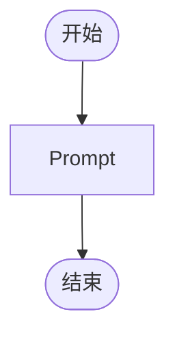

# workflow

## 步骤

### n23 (end)

(空)

### n25 (start)

(空)

### n32 (prompt)

读取用户提供的文档 ，用短符号词典的符号替换文档内容，短符号使用次数倒数5个（总数5个）移出词典。对 替换后的章节内容 进行新的短符号提取：按压缩比 （概念组字符 /短符号字符）用全新的短符号 替换 章内的 一组 概念，这组概念 必须字符数远大于这个短符号，把短符号 和 概念组 的配对放到 同文件夹下面 html文件里（编辑同一个文件就好），作为短符号词典，这种替换和配对可以有多组，如果某组概念的 短符号 替换了章内多处内容 那是高质量的短符号 ，章节把原来的概念组用短符号替换 ，字红色可明显看出，放到同文件夹下面（一个文件就好），读者可以通过差短符号词典 差意思 然后阅读 依然顺畅。概念组  是的词句组合，词句可能不是在原文中 连续的 ，但有被抽象的可能。短符号 和概念组的关系，可以比作成语和成语所表达意思的关系，但短符号 限制更少，最低要求起到符号作用即可, 注意 1 概念组里可以包含短符号，也就是说 一个短符号可以代表 由于短符号组成 或短符号和正常词句组成的概念组，注意2短符号在词典中 不要重复 也就是说同一个短符号代表一个概念组，概念组 字符 数 比上短符号 字符数的数值越大 在 淘汰时 不容易被淘汰，概念组包含短符号的短符号  淘汰时 不容易被淘汰 压缩比高的 不容易被淘汰注意 3压缩比 = 已有短符号数量/10
